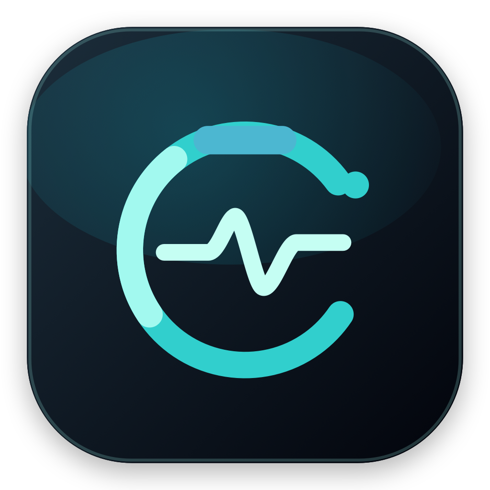
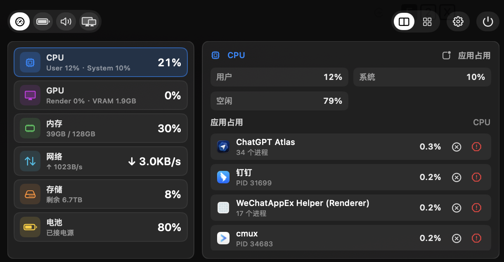
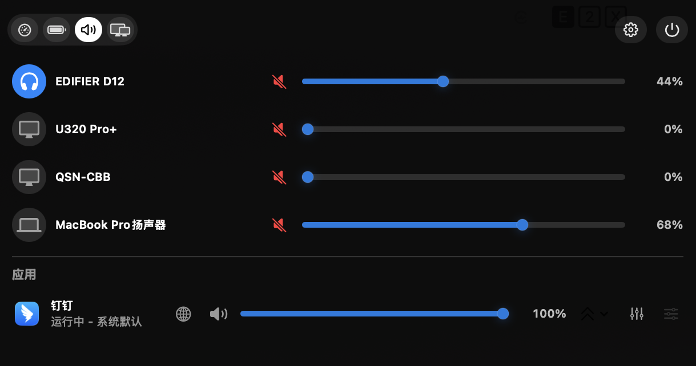

# PeakHalo

> 中文 | [English](#english)

PeakHalo 是一个 macOS 刘海 / 灵动岛监控工具。它把系统资源、显示器控制、音频控制和设备电量放进屏幕顶部的紧凑面板里，也支持通过菜单栏图标打开控制面板。

<p align="center">
  
</p>

## 截图

<p align="center">
  
  
</p>

## 功能

- 刘海与灵动岛两种显示样式。
- 支持在所有显示器或指定显示器上显示。
- 支持鼠标移入刘海 / 灵动岛展开，或点击菜单栏图标展开。
- 支持截图和录屏时隐藏面板。
- 资源监控：CPU、GPU、内存、网络、存储、电池。
- 应用资源列表：查看应用占用，并支持退出或强制退出。
- 显示器控制：内建屏亮度、外接屏 DDC/CI 亮度与音量。
- 音频控制：系统输出音量、输出设备、应用级音量控制。
- 设备电量：电脑电池、触控板、键盘、蓝牙耳机等可被系统暴露的设备电量。
- 国际化：默认中文，支持英文。

## 系统要求

- macOS 14 或更高版本。
- Swift 5.9 或更高版本。
- Xcode Command Line Tools。

部分能力依赖系统权限或硬件支持：

- 应用级音量控制需要授权“屏幕与系统音频录制”。
- 蓝牙配件电量需要系统能够读取并暴露该设备电量。
- 外接显示器亮度 / 音量控制依赖显示器和连接链路是否支持 DDC/CI。

## 构建与运行

```bash
swift build
```

项目提供了本地打包和运行脚本，会构建 SwiftPM 目标、生成 `.app` bundle、复制资源、写入 Info.plist、签名并启动应用。

```bash
./script/build_and_run.sh
```

验证应用能正常打包和启动：

```bash
./script/build_and_run.sh --verify
```

查看运行日志：

```bash
./script/build_and_run.sh --logs
```

## 构建安装包

生成本地安装包：

```bash
./script/package_app.sh
```

脚本会构建 release 版本，并输出到 `dist/release`：

- `PeakHalo-*.dmg`
- `PeakHalo-*.pkg`
- `PeakHalo-*.zip`

仓库也包含 GitHub Actions 工作流。推送 `v*` 标签或手动触发工作流时，会自动构建安装包并上传 artifacts。

发布新版本时，先提交所有变更，然后运行：

```bash
./script/tag_release.sh
```

脚本会读取最新的 `vX.Y.Z` tag，并自动把 patch 版本加 1 后创建和推送 annotated tag；如果仓库还没有版本 tag，则从 `v0.1.0` 开始。推送 `v*` 标签时，GitHub Actions 会自动构建安装包、上传 artifacts，并把安装包发布到同名 GitHub Release。普通分支提交不再自动触发构建。应用内“关于”页的更新检查会读取 GitHub Releases，并优先打开 `.dmg`、`.pkg` 或 `.zip` 安装包下载链接。

## 项目结构

```text
Sources/PeakHalo/App          应用入口
Sources/PeakHalo/Models       偏好设置、标签页和资源模型
Sources/PeakHalo/Notch        刘海 / 灵动岛窗口、形状和布局
Sources/PeakHalo/Metrics      系统资源采样与进程监控
Sources/PeakHalo/Services     音频、显示器、电量和菜单栏服务
Sources/PeakHalo/Stores       控制面板状态和数据缓存
Sources/PeakHalo/Views        SwiftUI 界面
Sources/PeakHalo/Resources    图标和本地化资源
script                        构建、运行和打包脚本
```

## 说明

PeakHalo 当前生成的是未公证安装包。开发验证以 `./script/build_and_run.sh --verify` 为准，安装包验证以 `./script/package_app.sh` 和 GitHub Actions artifacts 为准。

## English

PeakHalo is a macOS notch / Dynamic Island monitor. It puts system metrics, display controls, audio controls, and device battery levels into a compact top-screen panel. It can also be opened from the menu bar icon.

## Screenshots

<p align="center">
  
  
</p>

## Features

- Standard notch and Dynamic Island display styles.
- Show on all displays or on a selected display.
- Expand by hovering over the notch / island, or by clicking the menu bar icon.
- Hide the panel during screenshots and screen recordings.
- Resource monitoring: CPU, GPU, memory, network, storage, and battery.
- Per-app resource lists with quit and force quit actions.
- Display controls: built-in brightness, external DDC/CI brightness and volume.
- Audio controls: system output volume, output devices, and per-app volume.
- Device battery levels for the Mac battery, trackpad, keyboard, Bluetooth headphones, and other devices exposed by macOS.
- Localization: Chinese by default, English supported.

## Requirements

- macOS 14 or later.
- Swift 5.9 or later.
- Xcode Command Line Tools.

Some features depend on permissions or hardware support:

- Per-app volume control requires Screen & System Audio Recording permission.
- Bluetooth accessory battery levels depend on whether macOS exposes that device battery.
- External display brightness / volume depends on DDC/CI support from the display and connection path.

## Build And Run

```bash
swift build
```

The project includes a local script that builds the SwiftPM target, creates an `.app` bundle, copies resources, writes Info.plist, signs the bundle, and launches the app.

```bash
./script/build_and_run.sh
```

Verify that the app can be bundled and launched:

```bash
./script/build_and_run.sh --verify
```

Stream runtime logs:

```bash
./script/build_and_run.sh --logs
```

## Build Installer Packages

Build local installer packages:

```bash
./script/package_app.sh
```

The script builds a release app and writes outputs to `dist/release`:

- `PeakHalo-*.dmg`
- `PeakHalo-*.pkg`
- `PeakHalo-*.zip`

The repository also includes a GitHub Actions workflow. To publish a new version, commit all changes, then run:

```bash
./script/tag_release.sh
```

The script reads the latest `vX.Y.Z` tag, increments the patch version by one, then creates and pushes an annotated tag. If the repository has no version tags yet, it starts at `v0.1.0`. Pushing a `v*` tag automatically builds installer packages, uploads artifacts, and publishes the packages to the matching GitHub Release. Ordinary branch commits no longer trigger package builds. The workflow can still be started manually from GitHub Actions. The in-app update check in About reads GitHub Releases and prefers `.dmg`, `.pkg`, then `.zip` download links.

## Project Layout

```text
Sources/PeakHalo/App          App entry point
Sources/PeakHalo/Models       Preferences, tabs, and resource models
Sources/PeakHalo/Notch        Notch / Dynamic Island windows, shape, and layout
Sources/PeakHalo/Metrics      System metrics sampling and process monitoring
Sources/PeakHalo/Services     Audio, display, battery, and menu bar services
Sources/PeakHalo/Stores       Control panel state and cached data
Sources/PeakHalo/Views        SwiftUI views
Sources/PeakHalo/Resources    Icons and localized resources
script                        Build, run, and packaging scripts
```

## Notes

PeakHalo currently creates non-notarized packages. Use `./script/build_and_run.sh --verify` for development verification, and `./script/package_app.sh` or GitHub Actions artifacts for package verification.
